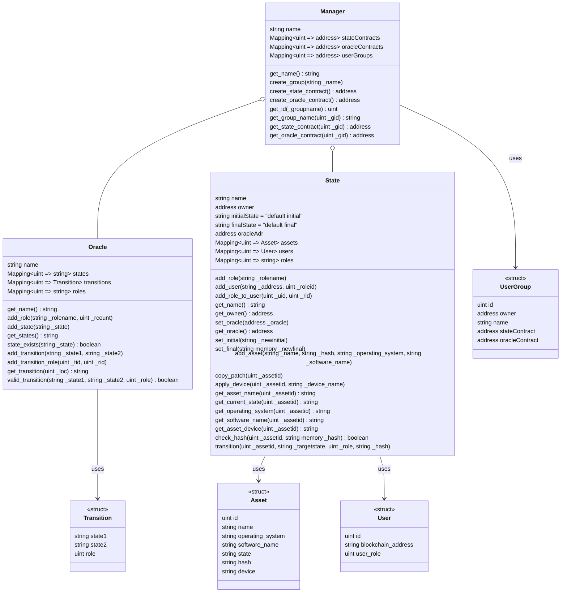
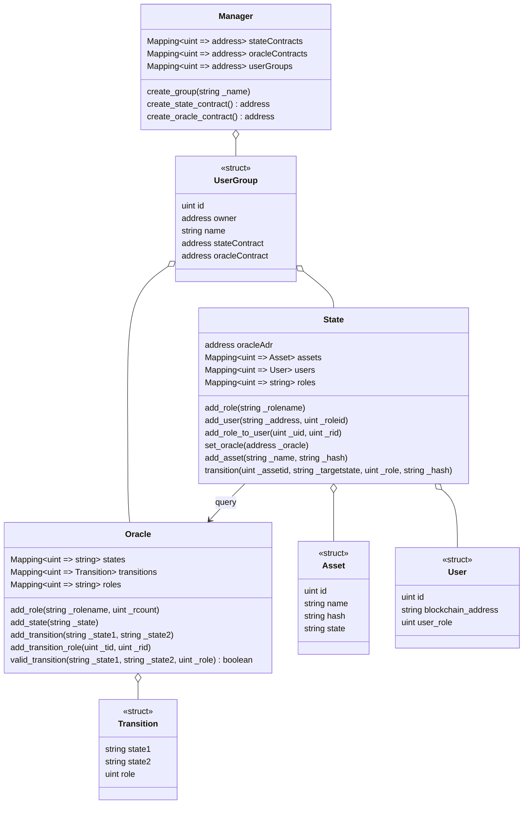

# Architecture Design of Smart Contracts

## Full architecture with all attributes and methods

```mermaid
classDiagram

class Manager{  
    string name
    Mapping~uint => address~ stateContracts
    Mapping~uint => address~ oracleContracts  
    Mapping~uint => address~ userGroups  

    get_name() string
    create_group(string _name)
    create_state_contract() address
    create_oracle_contract() address
    get_id(_groupname) uint
    get_group_name(uint _gid) string
    get_state_contract(uint _gid) address
    get_oracle_contract(uint _gid) address
}  

class Oracle{
    string name
    Mapping~uint => string~ states
    Mapping~uint => Transition~ transitions
    Mapping~uint => string~ roles

    get_name() string
    add_role(string _rolename, uint _rcount)

    add_state(string _state)
    get_states() string
    state_exists(string _state) boolean

    add_transition(string _state1, string _state2)
    add_transition_role(uint _tid, uint _rid)
    get_transition(uint _loc) string

    valid_transition(string _state1, string _state2, uint _role) boolean
}

class State{  
    string name
    address owner
    string initialState = "default initial"
    string finalState = "default final"
    address oracleAdr

    Mapping~uint => Asset~ assets
    Mapping~uint => User~ users
    Mapping~uint => string~ roles

    add_role(string _rolename)
    add_user(string _address, uint _roleid)
    add_role_to_user(uint _uid, uint _rid)

    get_name() string
    get_owner() address

    set_oracle(address _oracle)
    get_oracle() address

    set_initial(string _newinitial) 
    set_final(string memory _newfinal)

    add_asset(string _name, string _hash, string _operating_system, string _software_name)
    
    copy_patch(uint _assetid)
    apply_device(uint _assetid, string _device_name) 

    get_asset_name(uint _assetid) string
    get_current_state(uint _assetid) string
    get_operating_system(uint _assetid) string
    get_software_name(uint _assetid) string
    get_asset_device(uint _assetid) string
    
    check_hash(uint _assetid, string memory _hash) boolean

    transition(uint _assetid, string _targetstate, uint _role, string _hash)
}  

class UserGroup{
    <<struct>>
    uint id
    address owner
    string name
    address stateContract
    address oracleContract
}

class Transition {
    <<struct>>
    string state1 
    string state2
    uint role
}

class Asset{
    <<struct>>
    uint id
    string name
    string operating_system
    string software_name
    string state
    string hash
    string device
}

class User{
    <<struct>>
    uint id
    string blockchain_address
    uint user_role
}

Manager --> UserGroup: uses
Manager o-- Oracle
Manager o-- State
Oracle --> Transition: uses
State --> Asset: uses
State --> User: uses
```

## Architecture with only key attributes and methods and modified names

```mermaid
classDiagram
graph LR

class Manager{  
    Mapping~uint => address~ stateContracts
    Mapping~uint => address~ oracleContracts  
    Mapping~uint => address~ userGroups  

    create_group(string _name)
    create_state_contract() address
    create_oracle_contract() address
}  

class Oracle{
    Mapping~uint => string~ states
    Mapping~uint => Transition~ transitions
    Mapping~uint => string~ roles

    add_role(string _rolename, uint _rcount)

    add_state(string _state)

    add_transition(string _state1, string _state2)
    add_transition_role(uint _tid, uint _rid)

    valid_transition(string _state1, string _state2, uint _role) boolean
}

class State{  
    address oracleAdr
    Mapping~uint => Asset~ assets
    Mapping~uint => User~ users
    Mapping~uint => string~ roles

    add_role(string _rolename)
    add_user(string _address, uint _roleid)
    add_role_to_user(uint _uid, uint _rid)

    set_oracle(address _oracle)

    add_asset(string _name, string _hash)

    transition(uint _assetid, string _targetstate, uint _role, string _hash)
}  

class UserGroup{
    <<struct>>
    uint id
    address owner
    string name
    address stateContract
    address oracleContract
}

class Transition {
    <<struct>>
    string state1 
    string state2
    uint role
}

class Asset{
    <<struct>>
    uint id
    string name
    string hash
    string state
}

class User{
    <<struct>>
    uint id
    string blockchain_address
    uint user_role
}

Manager o-- UserGroup
UserGroup o-- Oracle
UserGroup o-- State
Oracle o-- Transition
State o-- Asset
State o-- User
State --> Oracle: query
```
